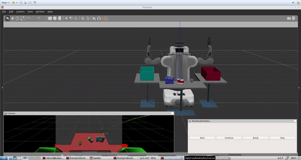
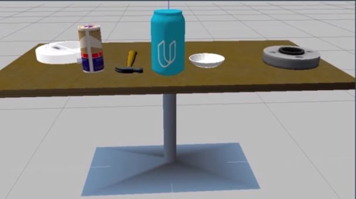
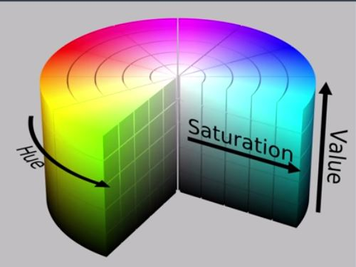
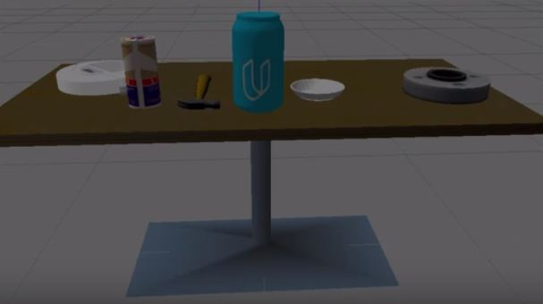
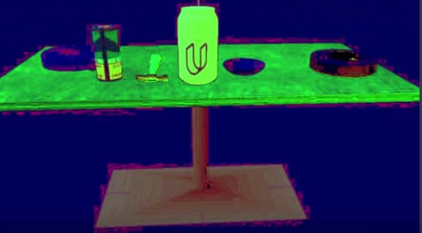
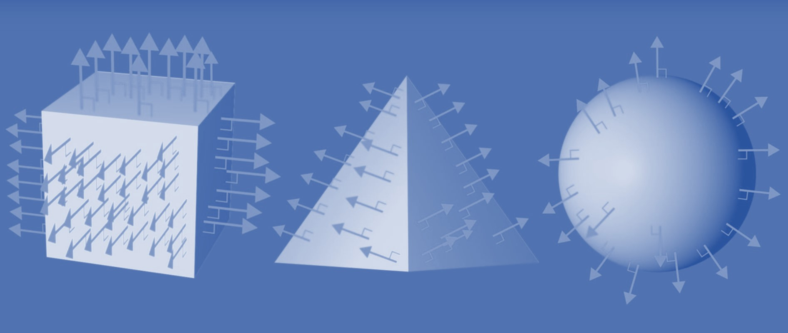
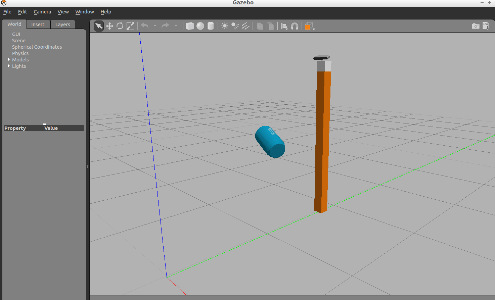
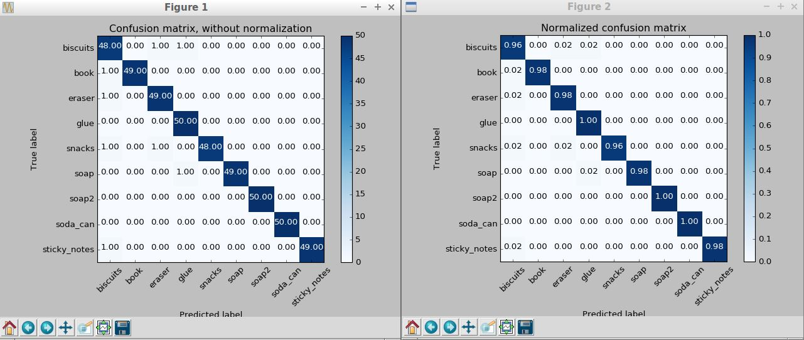
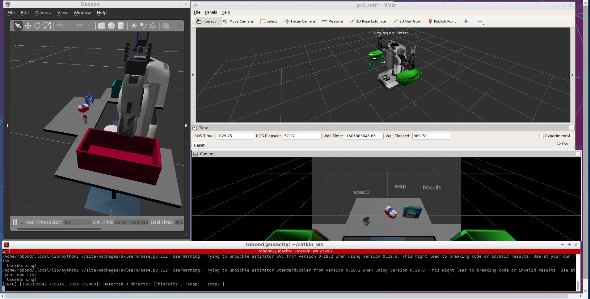

# 3D Perception
<p align="center">
  
</p>

This [Udacity clone project](https://github.com/udacity/RoboND-Perception-Project) is modeled after [Amazon Robotics Challenge](https://www.amazonrobotics.com/#/roboticschallenge/results). Giving a robot the ability to locate an object in a cluttered environment, pick it up and then move it to some other location is not just an interesting problem to try to solve,
it's a challenge at the forefront of the robotics industry today. 

A perception pipeline is created base on Exercises 1, 2 and 3  from [RoboND Percetion Excercises](https://github.com/fouliex/RoboND-Perception-Exercises) o identify target objects from a so-called “Pick-List” in that particular order, pick up those objects and place them in corresponding dropboxes.

# Perception Pipeline
## Tabletop Segmentation
The Table Segmentation is about applying some filtering techniques and use RANSAC plane fitting to segment a table in a point cloud.

### Downsample your point cloud by applying a Voxel Grid Filter
When running computation on full resolution point cloud can be slow and may not achieve any improvement on results obtained using a more widely apart sampled point cloud.
Therefore, in many cases, it is advantageous to downsample the data.

VoxelGrid is used to Downsampling Filter to drive a point cloud that has fewer points but should do a good job of representing the input point cloud as a whole. As the word "pixel" is short for "picture element", the word
"voxel" is short for "volume element". Just as we can divide a 2d image into a regular grid of area element, we can also divid up a 3D point cloud, into a regular 3D grid of volume elements. Each individual cell in
 grid is now voxel and the 3D grid is known as "Voxel Grid".

###### Voxel Grid Code
```python
def do_voxel_grid_downssampling(pcl_data,leaf_size):
    '''
    Create a VoxelGrid filter object for a input point cloud
    :param pcl_data: point cloud data subscriber
    :param leaf_size: voxel(or leaf) size
    :return: Voxel grid downsampling on point cloud
    '''
    vox = pcl_data.make_voxel_grid_filter()
    vox.set_leaf_size(leaf_size, leaf_size, leaf_size)
    return  vox.filter()
    
 # Convert ROS msg to PCL data
cloud = ros_to_pcl(pcl_msg)

# Voxel Grid Downsampling
LEAF_SIZE = 0.01
cloud = do_voxel_grid_downssampling(cloud,LEAF_SIZE)
```

#### 2D image into a regular grid of area elements(Left picture) and 3D grid volume elements(Right picture)


###### [**Voxel Downsampling Sample code**](https://github.com/fouliex/RoboND-Perception-Exercises/blob/master/Exercise-1/voxel_grid_downsampling.py)

### Apply Statistical Outlier Filtering

Statistical Outlier Filtering is use to remove outlieres using number of neighboring points of 10 and standard deviation
threshold of 0.001
###### Statistical Outlier Filtering Code
```python
def do_statistical_outlier_filtering(pcl_data,mean_k,tresh):
    '''
    :param pcl_data: point could data subscriber
    :param mean_k:  number of neighboring points to analyze for any given point
    :param tresh:   Any point with a mean distance larger than global will be considered outlier
    :return: Statistical outlier filtered point cloud data
    '''
    outlier_filter = pcl_data.make_statistical_outlier_filter()
    outlier_filter.set_mean_k(mean_k)
    outlier_filter.set_std_dev_mul_thresh(tresh)
    return outlier_filter.filter()

# Convert ROS msg to PCL data
cloud = ros_to_pcl(pcl_msg)

# Statistical Outlier Filtering
cloud = do_statistical_outlier_filtering(cloud,10,0.001)
```

### Apply a Pass Through Filter to isolate the table and objects.
When we have prior information about the location of a target in  the scene, we can apply a Pass Through Filter to remove useless data from our point cloud.
The Pass Through Filter  works just like a cropping tool, which allows us to crop any given 3D point cloud by specifying  an axis with cut-off values along that axis.
The region that we allow to pass through is referred as **region of interest**.

By applying a Pass Through filter along  z axis (the height with respect to the ground) to our tabletop scene in the
range 0.1 to 0.8 gives us the table and filtered out all of the objects.


By applying a Pass Through filter  with the following range 0.6 and 1.1 isolate our region of interest containing the
table and the objects on the table


###### PassThrouh Filter Code
```python
def do_passthrough(pcl_data,filter_axis,axis_min,axis_max):
    '''
    Create a PassThrough  object and assigns a filter axis and range.
    :param pcl_data: point could data subscriber
    :param filter_axis: filter axis
    :param axis_min: Minimum  axis to the passthrough filter object
    :param axis_max: Maximum axis to the passthrough filter object
    :return: passthrough on point cloud
    '''
    passthrough = pcl_data.make_passthrough_filter()
    passthrough.set_filter_field_name(filter_axis)
    passthrough.set_filter_limits(axis_min, axis_max)
    return passthrough.filter()
    
# Convert ROS msg to PCL data
cloud = ros_to_pcl(pcl_msg)

# PassThrough Filter
filter_axis ='z'
axis_min = 0.44
axis_max =0.85
cloud = do_passthrough(cloud,filter_axis,axis_min,axis_max)

filter_axis = 'x'
axis_min = 0.33
axis_max = 1.0
cloud = do_passthrough(cloud, filter_axis, axis_min, axis_max)    
```

###### [**Pass Through Filter Sample code**](https://github.com/fouliex/RoboND-Perception-Exercises/blob/master/Exercise-1/pass_through_filtering.py)

### Perform RANSAC plane filtering to identify the table.

To Remove the table completely from the scene we can use a  popular technique known as **Random Sample Consensus**(RANSAC). RANSAC is an algorithm which is used to identify points in out dataset that belong to a particular model.
In the  3D scene, the model can be a plane a cylinder, a box or any other common shape.

The algorithm assumes that all of the data in a dataset is composed of both **inliers** and **outliers**.
* Inliers can be defined by a particular model with a specific set of parameters.
* Outliers if that model does not fit then it gets discarded.

By modeling the table as a plane, we can remove it from the point cloud.


###### RANSAC Plane Filtering Code
```python
def do_ransac_plane_segmentation(pcl_data,pcl_sac_model_plane,pcl_sac_ransac,max_distance):
    '''
    Create the segmentation object
    :param pcl_data: point could data subscriber
    :param pcl_sac_model_plane: use to determine plane models
    :param pcl_sac_ransac: RANdom SAmple Consensus
    :param max_distance: Max distance for apoint to be considered fitting the model
    :return: segmentation object
    '''
    seg = pcl_data.make_segmenter()
    seg.set_model_type(pcl_sac_model_plane)
    seg.set_method_type(pcl_sac_ransac)
    seg.set_distance_threshold(max_distance)
    return seg
# Convert ROS msg to PCL data
cloud = ros_to_pcl(pcl_msg)
    
# RANSAC Plane Segmentation
ransac_segmentation = do_ransac_plane_segmentation(cloud,pcl.SACMODEL_PLANE,pcl.SAC_RANSAC,0.01)

# Extract inliers and outliers
cloud_table,cloud_objects= extract_cloud_objects_and_cloud_table(cloud,ransac_segmentation )
```

## Euclidean Clustering with ROS and PCL
To perform  Euclidean Clustering, a [k-d tree](http://pointclouds.org/documentation/tutorials/kdtree_search.php) from the 'cloud_objects' point cloud needs to be constructed.

The k-d tree data structure is used in the Euclidian Clustering algorithm to decrease the computational burden of 
searching for neighboring points. While other  efficient algorithms/data structures for nearest neighbor search exist, PCL's
Euclidian Clustering algorithm only supports k-d trees.


###### Eucliean Cluster Extraction Code
```python
def do_euclidean_clustering(white_cloud):
    '''
    :param cloud_objects:
    :return: cluster cloud and cluster indices
    '''
    tree = white_cloud.make_kdtree()

    # Create Cluster-Mask Point Cloud to visualize each cluster separately
    ec = white_cloud.make_EuclideanClusterExtraction()
    ec.set_ClusterTolerance(0.015)
    ec.set_MinClusterSize(50)
    ec.set_MaxClusterSize(20000)
    ec.set_SearchMethod(tree)
    cluster_indices = ec.Extract()
    cluster_color = get_color_list(len(cluster_indices))

    color_cluster_point_list = []

    for j, indices in enumerate(cluster_indices):
        for i, indice in enumerate(indices):
            color_cluster_point_list.append([white_cloud[indice][0],
                                             white_cloud[indice][1],
                                             white_cloud[indice][2],
                                             rgb_to_float(cluster_color[j])])

    cluster_cloud = pcl.PointCloud_PointXYZRGB()
    cluster_cloud.from_list(color_cluster_point_list)
    return cluster_cloud,cluster_indices
    
# Euclidean Clustering
white_cloud= XYZRGB_to_XYZ(cloud_objects)
cluster_cloud,cluster_indices = do_euclidean_clustering(white_cloud)
```
## Object Recognition
Object Recognition is a central theme in computer vision and perception for robotics. When we view a scene with our eyes,
we are constantly performing the task of object recognition for the world we see before us. With sensors, a robot can
perceive the world around it in terms of depth, color etc. Therefore a robot can recognize objects in its surroundings,
just like we do.

In any given image or a 3D point cloud, we might find a variety of objects of differing shapes and sizes. In many robotic
application, there will be a particular object that we are looking for in the scene, similar to the [Amazon Robotics Challenge](https://www.amazonrobotics.com/#/roboticschallenge/results). This
object of interest might be at any distance any orientation, and it might even be obscured by other objects in the scene.
Therefore, the question is how can we reliably locate what we are looking for in our field of view, regardless of its position or 
orientation?

The goal is to find the features that best describe the object we are looking for. The better the  description of the 
object we are looking for, the more likely the algorithm is to find it. Which is to say the better we can characterize 
the feature that uniquely differentiate our target from other objects in the scene, the more robust  our object recognition algorithm will be.

### Features
With a feature set in hand, we can train a classifier to recognize the object that we are searching for in our point 
cloud.

Having prior knowledge of things  like where we expect to find our object of interest can help us zero in on the areas of 
the point cloud containing our object.


After segmentation, we have a point cloud that we have broken down into individual objects and for each point in the cloud
we have RGV color information as well as spatial information in three dimensions.


Therefore, it makes sense to explore feature sets that include some combination of this color and shape information in a
way that differentiates our object of interest from objects in the environment.


### Color Spaces
For the data, we have been working with so far, we know that just like each pixel and images, each point in our point 
cloud has an associated set of red, green, and blue or RGB color values. In the
[Search and Sample project](https://github.com/fouliex/SearchAndSampleRoverProject) we use a combination
of color threshold on the RGB values to pick out light versus dark areas or to isolate a particular color.

We can think of RGB values as filling a color grid like the picture below. Where the position along each of the axes 
defines how much red, green, and blue, we have a point because objects can appear to have quite a different color 
under different lighting conditions. Fortunately, it's easy to convert our data to other color representation in order to
make our thresholding or color selection operations less sensitive to changes in lighting.

RGB representation of color does an excellent job of reproducing what we see with our own eyes, but it's not the most robust
color representation for perception tasks in robotics.

Different color representations as known as color spaces and one such color space that is particularly robust to lighting
change is HSV which stands for hue, saturation and value.In the HSV space, color is represented by a cylinder as seen below.

 

You can think of the hue which is described as angular position around the cylinder as describing what color is in a 
pixel, the saturation which is measured as a radial distance from the center axes as being the intensity of that color, and
value or aural brightness along the vertical axes.


To convert an RGB image to HSV color space we can use the cv2 ro convert color function like this
```python
hsv_image = cv2.cvtColor(rgb_image,cv2.COLOR_RGB2HSV)
```
Here's an image in RGB color space

 

and here's what it looks like in an HSV color space. Where red now represent hue, green saturation, and blue value.

 

If we turn the light down on the scene, the RGB image looks like the picture below

 

But the colorful objects still appear bright in HSV


We can darken the RGB image even further, but the objects in the HSV image will remain bright.
To use HSV, in [capture_features.py](/pr2_robot/scripts/capture_features.py) change the flag to `using_hsv=True` from `compute_color_histograms()`.


### Color Histograms
One way to convert color information into features that we can use for classification is by building up our color value
into a histogram. To construct a histogram, we simply need to divide up the rage of our data values from 0-255, in this
case into discrete bins.Then count up how many of the values fall into each bin. When we compare the colored histogram
of a known object image with regions of a test image, locations with similar color distributions will reveal a close match.
  
With this method we have removed any dependence on spatial structure, that is, we are no longer sensitive to a perfect
arrangement of points.Therefore, objects that appear in slightly different poses and orientations will still be matched.

Variations in image size can also be accommodated by normalizing the histograms.However, note that we are now solely
relying on the distribution of color values which might match some unwanted regions resulting in false positives.
  

### Surface Normals 
As one can see color can be used for object recognition, but another powerful way to find what we are looking for in our 
data is by searching for particular shapes vector images. We can search for a given template shape or simply take the
gradient of the image and explore the distribution of lights and edges that emerge. Since we are working with 3D point
clouds, we have an extra dimension of shape information to investigate. In our point cloud, we have partial information
 on the 3D shapes of the object which is to say we have the view of the object surface from just one perspective. What
 we would like to do is to compare the distribution of points with a ground truth or reference distribution in order to
 decide whether or not we have found what we are looking for. To do this, we need a metric that captures shape and one such
 metric is the **distribution of surface normals.**
 
 The normal of a surface is just a unit vector that is perpendicular to that surface. The normals at different points,
 along with the changing surface, will point in different direction and the distribution of surface normals taken a whole
 can be used to describe the shape of the objects.
 
We can create this distribution the same with color by building up the individual surface normals into a histogram.

### Object Recognition Code
Below is the  Object Recognition snippet Code.
The entire sourcecode is located in the `project_template.py`  which is located in the [script folder](/pr2_robot/scripts/) folder.


```python

 # Classify the clusters
    detected_objects_labels = []
    detected_objects = []

    for index, pts_list in enumerate(cluster_indices):
        # Grab the points for the cluster
        pcl_cluster = cloud_objects.extract(pts_list)
        ros_cluster = pcl_to_ros(pcl_cluster)

        # Extract histogram features
        chists = compute_color_histograms(ros_cluster, using_hsv=True)
        normals = get_normals(ros_cluster)
        nhists = compute_normal_histograms(normals)
        feature = np.concatenate((chists, nhists))

        # Make the prediction
        prediction = clf.predict(scaler.transform(feature.reshape(1, -1)))
        label = encoder.inverse_transform(prediction)[0]
        detected_objects_labels.append(label)

        # Publish a label into RViz
        label_pos = list(white_cloud[pts_list[0]])
        label_pos[2] += .4
        object_markers_pub.publish(make_label(label, label_pos, index))

        # Add the detected object to the list of detected objects.
        do = DetectedObject()
        do.label = label
        do.cloud = ros_cluster
        detected_objects.append(do)

    rospy.loginfo('Detected {} objects: {}'.format(len(detected_objects_labels), detected_objects_labels))

    # Publish the list of detected objects
    detected_objects_pub.publish(detected_objects)
```

### Training a classifier  from the Gazebo World
From  the gazebo world, we can extract color and shape features from the objects segmented from our point
 cloud  in order to train  a classifier to detect each object.

 We can generate a training set of features for all objects in the pick list files in [/pr2_robot/config/](/pr2_robot/config/).
 Each pick list corresponds to a world or a scenario, therefore indicating what items will be present in that scenario.
 To generate the training set, the models list in the python file [capture_features.py](/pr2_robot/scripts/capture_features.py)

 To test with the project, first run:
 ```sh
$ cd ~/catkin_ws
$ rosrun sensor_stick capture_features.py
 ```



### Confusion Matrix
Once the feature extraction is completed, we can train our model by running the python file `train_svm.py`.
 ```sh
$ rosrun sensor_stick train_svm.py
 ```
The script will create the Confusion Matrix and generate  the trained model(model.sav)

These plots are showing two different versions of the confusion matrix for the classifier.On the left is raw counts and
 on the right as a percentage of the total. Trained model are saved in the model folder 

# Pick and Place
For this project, we have a variety of different objects to identify. There are 3 different worlds(test1.world, test2.world and test3.world) to work with where each world has different items on the table in front of the robot.
These worlds are located in the [/pr2_robot/worlds/](./pr2_robot/worlds/)
 Object recognition can be performed base on the train model.sav generated. The program read each pick list which are pick_list1.yaml
pick_list_2.yaml and pick_list_3.yaml and display the name of each objects.

## First World
For the first world, PR2 was able to identify all 3 items which are the soap sop2 and biscuits. See output_1.yaml located in the [/pr2_robot/output/](./pr2_robot/output/)

## Second World
For the second world, PR2 was able to identify 4 out of 5 items which are soap2 book soap and biscuits.  For some reason, PR2 was unable to recognize the glue, it keeps seeing it as a snacks. See output_2.yaml located in the [/pr2_robot/output/](./pr2_robot/output/)

## Third World
For the third world, PR2 was able to identify all 8 objects. See output_3.yaml located in the [/pr2_robot/output/](./pr2_robot/output/)


# Project Setup
For this setup, catkin_ws is the name of active ROS Workspace, if your workspace name is different, change the commands accordingly
If you do not have an active ROS workspace, you can create one by:

```sh
$ mkdir -p ~/catkin_ws/src
$ cd ~/catkin_ws/
$ catkin_make
```

Now that you have a workspace, clone or download this repo into the src directory of your workspace:
```sh
$ cd ~/catkin_ws/src
$ git clone https://github.com/udacity/RoboND-Perception-Project.git
```

Now install missing dependencies using rosdep install:
```sh
$ cd ~/catkin_ws
$ rosdep install --from-paths src --ignore-src --rosdistro=kinetic -y
```
Build the project:
```sh
$ cd ~/catkin_ws
$ catkin_make
```
Add following to your .bashrc file
```
export GAZEBO_MODEL_PATH=~/catkin_ws/src/RoboticPerception/pr2_robot/models:$GAZEBO_MODEL_PATH
```

If you haven’t already, following line can be added to your .bashrc to auto-source all new terminals
```
source ~/catkin_ws/devel/setup.bash
```

To run the demo:
```sh
$ cd ~/catkin_ws/src/RoboticPerception/pr2_robot/scripts
$ chmod u+x pr2_safe_spawner.sh
$ ./pr2_safe_spawner.sh
```


Once Gazebo is up and running, make sure you see following in the gazebo world:
- Robot

- Table arrangement

- Three target objects on the table

- Dropboxes on either sides of the robot

In your RViz window, you should see the robot and a partial collision map displayed:


Proceed through the demo by pressing the ‘Next’ button on the RViz window when a prompt appears in your active terminal

The demo ends when the robot has successfully picked and placed all objects into respective dropboxes (though sometimes the robot gets excited and throws objects across the room!)

Close all active terminal windows using **ctrl+c** before restarting the demo.

You can launch the project scenario like this:
```sh
$ roslaunch pr2_robot pick_place_project.launch
```
